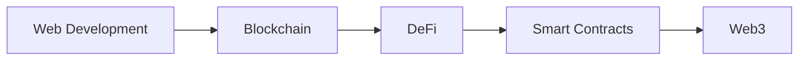

// ... existing code ...

  
🎯 Specialized in Smart Contract Development & DeFi Solutions

  
🌐 Building the Future of Web3 | Blockchain Enthusiast

  
🔗 Contributing to Open Source Projects

  
📚 Continuous Learner & Tech Explorer

## 🎯 Current Focus

- 🔭 Working on **Multi-Signature Wallet Project**
- 🌱 Learning **Zero Knowledge Proofs & Layer 2 Solutions**
- 👯 Looking to collaborate on **Blockchain & DeFi Projects**
- 💡 Interested in **Smart Contract Security & Auditing**
- 🎯 2024 Goals: **Contribute to Major DeFi Protocols**

## 💼 Experience

## 🛠️ Technical Skills

| Category | Technologies |
|----------|-------------|
| Languages | JavaScript, TypeScript, Python, Solidity, C++ |
| Frontend | React.js, Next.js, HTML5, CSS3, Tailwind CSS |
| Backend | Node.js, Express.js, MongoDB, MySQL |
| Blockchain | Ethereum, Hardhat, Web3.js, Ethers.js |
| Tools | Git, Docker, Linux, VS Code, Postman |
| Cloud | AWS, Vercel, Heroku |

## 🏆 Achievements & Certifications

- 🥇 **Blockchain Developer Certification** - Ethereum Foundation
- 🏆 **Smart Contract Security Expert** - Advanced Level
- 🌟 **Open Source Contributor** - Multiple DeFi Projects
- 📊 **Full Stack Development** - MERN Stack Specialist

## 📈 GitHub Stats

  
  

// ... rest of existing code ...
